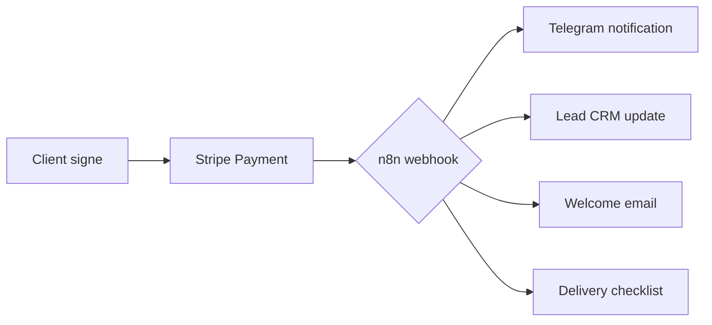

# Stripe Setup — YellowMarket LLC (5 Services)

## Prérequis ✅
- **LLC Wyoming** — Déjà active ✅
- **EIN (IRS)** — À vérifier (Form SS-4 si non fait)
- **US Bank Account (Mercury)** — Déjà actif ✅
- **US Phone Number** — Pour vérification Stripe (Google Voice ou sim US)

---

## Étapes de création Stripe

### 1. Créer le compte Stripe
1. Aller sur [stripe.com](https://stripe.com)
2. Cliquer **"Start now"** ou **"Create account"**
3. Utiliser **hello@yellowmarket.co** (email pro)
4. Mot de passe → générer via password manager

### 2. Informations légales
Champ | Valeur
------|-------
**Entity type** | LLC
**Company name** | YellowMarket LLC
**EIN** | [Ton EIN — vérifier]
**Address** | Adresse enregistrée Wyoming (Registered Agent address)
**Business phone** | (307) 331-8605 (Wyoming area code = crédibilité US)
**Website** | yellowmarket.co
**Business description** | "Web design and digital marketing services for local businesses"
**Business URL** | https://yellowmarket.co

### 3. Infos personnelles (Teo)
Stripe demande un **"representative"** de la LLC — ce sera Teo:
- Full legal name
- Date of birth
- Derniers 4 chiffres SSN → **Optionnel pour non-US.** Stripe accepte un **passport scan** à la place.
- Passport scan → photo claire du passport (Philippines ou France)

### 4. Banking
Connecter **Mercury bank account**:
- Account number + routing number (Mercury dashboard → Account details)
- Stripe fera 2 micro-deposits ($0.01-$0.99) pour vérifier le compte
- Vérifier Mercury dans 1-2 jours ouvrés

### 5. Paiement activé
- Stripe active les paiements sous **24-72h** après soumission des docs
- Pas de frais mensuels — uniquement **2.9% + $0.30/transaction**
- Stripe Billing pour abonnements mensuels (maintenance)

---

## 5 Service Pricing Packages (à coller dans Stripe)

### Service 1 — Professional Website ($299+)
```
Name: Professional Website
Amount: $299.00 (one-time)
Description:
• Responsive 5-page website
• Mobile-first, lightning fast
• Click-to-call & contact forms
• Google Maps integration
• SEO-optimized structure
• Free hosting (1 year)
```

### Service 2 — Google Business Profile ($199+)
```
Name: Google Business Profile Optimization
Amount: $199.00 (one-time)
Description:
• Full GBP setup & verification
• NAP consistency audit
• Photo & post management
• Review generation system
• Response management
• Monthly performance report
```

### Service 3 — AI Receptionist ($499 setup + $199/mo)
```
Name: AI Receptionist Setup
Amount: $499.00 (one-time setup fee)
Monthly: $199.00/month
Description:
• 24/7 AI voice answering
• Natural conversation (GPT-powered)
• Lead qualification & scoring
• Automatic appointment booking
• Multilingual support
• Weekly call transcript report
```

### Service 4 — Google Ads ($499 setup + ad spend)
```
Name: Google Ads Campaign Setup
Amount: $499.00 (one-time setup)
Ad Spend: Client's budget (managed)
Description:
• Campaign strategy & setup
• Keyword research & targeting
• Ad copy & extensions
• Budget management
• Conversion tracking
• Monthly performance review
```

### Service 5 — Local SEO ($399/mo)
```
Name: Local SEO Package
Amount: $399.00/month
Billing: Monthly (Stripe Subscription)
Description:
• Local keyword strategy
• City & service pages
• Schema markup (LocalBusiness)
• Link building & citations
• AI search optimization
• Monthly ranking reports
```

---

## Stripe Products & Prices (Dashboard)

1. Aller dans Stripe Dashboard → **Products** → **Add product**
2. Créer 3 produits one-time:
   - Professional Website — $299
   - Google Business Profile — $199
   - AI Receptionist Setup — $499
3. Créer 2 produits recurring:
   - AI Receptionist — $199/mo
   - Local SEO — $399/mo

---

## Connecter Stripe au site YellowMarket

### Option 1 — Stripe Checkout (recommandé pour MVP)
```html
<!-- Bouton de paiement Stripe -->
<a href="https://buy.stripe.com/[VOTRE_LIEN]" class="btn btn-primary">
  Get Started — $299
</a>
```
- Stripe génère un lien de paiement pour chaque produit
- Pas de code, pas de serveur
- Le client paie → Stripe notifie par email → Tu reçois l'argent sous 2-3 jours

### Option 2 — Stripe Payment Links (encore plus simple)
1. Stripe Dashboard → **Payment Links**
2. Créer un link par package
3. Ajouter les liens sur le site YellowMarket

### Option 3 — Custom checkout (quand n8n sera actif)
- n8n webhook → Stripe Checkout Session → Redirect → Confirmation
- Workflow n8n : form submit → create Stripe session → redirect → notification Telegram

---

## Workflow Stripe + n8n (Post-Setup)



1. Stripe envoie webhook à `http://localhost:5678/webhook/stripe-payment`
2. n8n reçoit → notifie Telegram de Teo
3. n8n met à jour la fiche lead dans Obsidian/Notion
4. n8n envoie email de confirmation au client
5. n8n crée une checklist de delivery

---

## Vérification

- [ ] Stripe account créé
- [ ] EIN vérifié / demandé
- [ ] Mercury bank connecté
- [ ] Micro-deposits confirmés
- [ ] Produits créés (3 one-time + 3 recurring)
- [ ] Payment Links générés
- [ ] n8n webhook configuré (si n8n actif)
